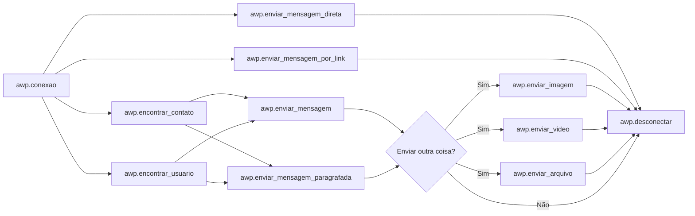

<h1 align="center">
<br>AllWhatsPy - AWP
</h1>


 
<h1 align="center">


<div align="center">
    
   
   
   
   
   
   
</div>
</h1>

> English Translation

>Created by [Lucas Lourenço](https://github.com/DevLucasLourenco/AllWhatsPy#autor)

>Maintained by [Lucas Lourenço](https://github.com/DevLucasLourenco/AllWhatsPy#autor)

<div align="center">
   <h1>ATTENTION</h1><br>
</div>

 > The code is going through a big update.<br> As time passes I will be refactoring and explaining the new functions.<br><br>
 Sincerely,<br>
 Lucas Lourenço


## Summary

- [Tutorial](https://github.com/DevLucasLourenco/AllWhatsPy#tutorial-em-v%C3%ADdeo2)
- [AllWhatsPy](https://github.com/DevLucasLourenco/AllWhatsPy#por-que-allwhatspy)
- [Installation](https://github.com/DevLucasLourenco/AllWhatsPy#come%C3%A7ando-no-allwhatspy)
- [To do list](https://github.com/DevLucasLourenco/AllWhatsPy#objetivos-a-serem-terminados)
- [Exemples](https://github.com/DevLucasLourenco/AllWhatsPy#exemplos)
- [Codes](https://github.com/DevLucasLourenco/AllWhatsPy#o-que-voc%C3%AA-pode-fazer-com-allwhatspy)
- [Creator Notes](https://github.com/DevLucasLourenco/AllWhatsPy#notas-do-criador)
- [Autor](https://github.com/DevLucasLourenco/AllWhatsPy#autor)
- [Contribuition](https://github.com/DevLucasLourenco/AllWhatsPy#contribui%C3%A7%C3%A3o)
- [Errors](https://github.com/DevLucasLourenco/AllWhatsPy#problemas-com-o-allwhatspy)


## Video Tutorial

<h1 align="center">
 
<a href="https://youtu.be/2Z74Y_V80SA">

</a>

</h1>


## ⭐ Rate the code! ⭐


It is really important the `Star` that you can be giving to help with the `Maintenance` and `Updates` of the code!
If you utilize AllWhatsPy frequently, like the way it was developed and cares about it, I will be very gratefull with your rating!

<h1 align="center">
<a href="https://github.com/DevLucasLourenco/AllWhatsPy/stargazers">

</a>
</h1>


## Why AllWhatsPy?

As we know, Whatsapp is a tool that we can no longer live without.
Be for professional or private use, it is necessary the full control of this aplication.

So... Why not make it <b>`even more efficient`?</b>

After thinking about it, I started to search about Bots ans APIs for Whatsapp, I got inspired by codes like the ones from [PyWhatsapp](https://github.com/shauryauppal/PyWhatsapp) and [PyWhatKit](https://github.com/Ankit404butfound/PyWhatKit) for making this one.

Posterior to a time studying and switching between work and the software, I've put my hands at work and started my journey looking for the upgrade and quality of the Software. I'm still updanting and developing, doing this all by myself.

More than Foram usadas mais de [11 thousand log lines](https://github.com/DevLucasLourenco/AllWhatsPy/edit/main/README.md#-3) were used for the full funtioning of the code.

With AllWhatsPy, you can do [whatever you want!](https://github.com/DevLucasLourenco/AllWhatsPy/edit/main/README.md#o-que-voc%C3%AA-pode-fazer-com-allwhatspy)


</br>
</br>
  
## Starting in AllWhatsPy

<div align="center">
   <h2>
      INSTTALLING
   </h2>
</div>

To install the lib, in the terminal do:

```
pip install -U allwhatspy-awp
```

Afterwards, call the package. Here's an example: Após, chame o pacote. Segue um exemplo:

```python
import AllWhatsPy as awp
```


You can also download the files then paste it on your folder, if your machine is having problems installing the lib.

</br>

### Logic:




## Unfinished Objectives 

- [x] Create alternatives for message sending (Done - 19/12/2022)
- [x] Fix the `except Exception` (Done - 21/12/2022)
- [x] Bug Fixing on urllib (Realizado - 21/12/2022)
- [x] Feeding the code with alternatives for `awp.conexao()` e  `awp.desconectar()` (Done - 21/12/2022)
- [x] Fix excepts of `NoSuchElementException`  (Done - 22/12/2022)
- [x] Implement WebDriverWait to upgrade the software responsiviness (Done - 27/12/2022)
- [x] Configure `log` entrances (Done - 28/12/2022)
- [x] Update ActionChains (Done - 15/01/2023)
- [x] Finish `ultimas_mensagens_conversa()` (Done - 18/01/2023)
- [x] Explain all formulas (Done - 21/01/2023)
- [x] Upgrade the `scheduling` functions (Done - 21/01/2023)
- [x] Finish the `summary` (Done - 21/01/2023)
- [x] Implement the `Pratical Examples` area (Done - 21/01/2023)
- [x] Make a video and post it on Youtube explaining to utilize the code (Done - 22/01/2023)
- [x] Implement conventional examples (Done - 23/01/2023) 
- [x] Change image of AWP logic with Mermaid (Done - 23/01/2023)
- [x] Finish function `encontrar_numeros_não_salvos()` (Done - 25/01/2023)
- [x] Classes Implementation Classes (Done - 12/02/2023)
- [x] Develop a `pip install` for AWP (Done - 12/02/2023)
- [x] Update `nome_usuario()` (Done - 15/02/2023)
- [x] Update the bug in the `desconectar()` function (Done - 20/02/2023)
- [x] Fix bug in the `pegar_foto_contato()` function (Done - 21/02/2023)
- [x] Update AWP icon (Done - 25/02/2023)
- [ ] Update `contato_nome()`
- [ ] Make an explanation of how to start in AWP
- [ ] Perform folder creation with the `pathlib` lib for better software quality
- [ ] Finish `buscar_contatos_não_lidos()` function
- [ ] Finish `retornar_posicao_anterior()` function
- [ ] Implementation of Classes, Methods and Helper Modules


## 🚨Examples🚨

<details>
<summary>
 🚨Pratical Examples🚨
</summary>

<p>

 - [Pratical Example - Data Treatment with AWP Execution](/exemplos/TratamentoDeDados-Execução.py)
 
 - [Pratical Example - Scheduling a List with AWP Execution](/exemplos/ListaDeAgendamentos-ExecucaoAWP.py)
 
 - [Pratical Example - Rolling Down Chats and Returning the Messages](/exemplos/DescendoChatsBuscandoMensagens-ExecuçãoAWP.py)
</p>

</details>


<details>
<summary>
 🚨Examples🚨
</summary>

<p>

 - [Example](/exemplos/exemplo.py)
 
 - [Example]()
 
</p>

</details>


  
## What you can do with AllWhatsPy


- ##  To Connect

> It is of great importance to use this code! After all, he is responsible for integrating AllWhatsPy with Whatsapp.
> It is possible to utilize as `awp.conexao()` or `awp.conexao(2)`. At first case, a popup will open on the screen, waiting for confirmation to continue.
> In the second case, the popup that appears after the algorithm initialization will be ignored.

<p>
  
```python
import AllWhatsPy as awp

awp.conexao()
```
</p>


or


<p>
  
```python
import AllWhatsPy as awp

awp.conexao(2)
```
</p>


- ## Disconnect

> After completing all the functions that are used by you, if you want to disconnect Whatsapp, run this code. Otherwise, your login will always be registered as still connecting, no matter how much you close the window.
> It can be used as `awp.desconectar()` or `awp.desconectar(2)`. If the first case is used, the software will exit and close the window. In the second case, it will keep the QR Code window open.
<p>
  
  ```python
import AllWhatsPy as awp


awp.conexao()
awp.desconetar()
```  
</p>

- ## Working with Chats/Contacts/Users

  - ### encontrar_contato(contato)
  <p>
  
    > With this function, we will open chats to proceed with the other codes. It will search by name or number, as long as it is already saved.
    

  ```python
  import AllWhatsPy as awp
    
  awp.conexao()
  awp.encontrar_contato('Lucas Lourenço')
   
  awp.desconectar()
  ```

  </p>

  - ### encontrar_usuario(numero)
  <p>
  
    > With this function, we can't search by name, but only by number. However, you DO NOT need to have the number saved.
  It may be viable for sending messages to spreadsheets with numbers and such.
    

  ```python
  import AllWhatsPy as awp

    
  awp.conexao()
  awp.encontrar_usuario('21900000000')
   
  awp.desconectar()
  ```

  
  </p>

  - ### encontrar_primeira_conversa(ignorar_fixado = True)
  <p>
  
    > Essa função será responsável por abrir a primeira conversa do seu Whatsapp.
  Caso "ignorar_fixado" for True, ele irá verificar se há uma conversa fixada e pular a mesma.
  Se o valor de "ignorar_fixado" for False, irá selecionar o primeiro comentário fixado.
    

  ```python
  import AllWhatsPy as awp
    
  awp.conexao()
  awp.encontrar_primeira_conversa()
   
  awp.desconectar()
  ```

  
  </p>
  
  
  - ### descer_conversa_origem_atual(quantidade: int = 1)
  <p>
  
    > Essa função irá descer a conversa atual que estiver aberta.
    Como argumento, é possível indicar quantas você quer descer. Já é 1 por padrão. 
    

  ```python
  import AllWhatsPy as awp
    
  awp.conexao()
  awp.encontrar_contato('Lucas Lourenço')
  awp.descer_conversa_origem_atual()
   
  awp.desconectar()
  ```

  </p>  
  
  
  - ### subir_conversa_origem_atual(quantidade: int = 1)
  <p>
  
    > Essa função irá subir a conversa atual que estiver aberta.
    Como argumento, é possível indicar quantas você quer subir. Já é 1 por padrão. 
    

  ```python
  import AllWhatsPy as awp
    
  awp.conexao()
  awp.encontrar_contato('Lucas Lourenço')
  awp.subir_conversa_origem_atual()
   
  awp.desconectar()
  ```

  </p> 


  - ### descer_chat_quantidade(quantidade: int)
  <p>
  
    > Essa função irá desce a conversa atual que estiver aberta de acordo com a quantidade declarada.
     

  ```python
  import AllWhatsPy as awp
    
  awp.conexao()
  awp.descer_chat_quantidade()
   
  awp.desconectar()
  ```

  </p> 


  - ### sair_da_conversa()
  <p>
  
    > Função responsável por sair da conversa atualmente aberta.
     

  ```python
  import AllWhatsPy as awp
    
  awp.conexao()
  awp.encontrar_usuario(21900000000)
  awp.enviar_mensagem('Olá!')
  awp.sair_da_conversa()
  
  ```

  </p> 


  - ### aplicar_filtro()
  <p>
  
    > Função responsável por aplicar o filtro, aparecendo somente as mensagens que não foram lidas.
     

  ```python
  import AllWhatsPy as awp
    
  awp.conexao()
  awp.aplicar_filtro()
   
  awp.desconectar()
  ```

  </p> 


  - ### pegar_dados_contato()
  <p>
  
    > Esta função retornará uma lista contendo o nome e o número do contato que está aberto.
    Sendo o índice 0 o nome e o índice 1 o número
     

  ```python
  import AllWhatsPy as awp
  
    
  awp.conexao()
  dados = awp.pegar_dados_contato()
  
  ```

  </p>


  - ### apagar_conversa()
  <p>
  
    > Através desta função, a conversa atualmente aberta será excluida.
     

  ```python
  import AllWhatsPy as awp
    
  awp.conexao()
  awp.encontrar_contato('Lucas Lourenço')
  awp.apagar_conversa()
  
  awp.desconectar()
  
  ```

  </p>
  
  
  - ### arquivar_conversa()
  <p>
  
    > Através desta função, a conversa atualmente aberta será arquivada.
     

  ```python
  import AllWhatsPy as awp
  
    
  awp.conexao()
  awp.encontrar_contato('Lucas Lourenço')
  awp.arquivar_conversa()
  
  awp.desconectar()
  
  ```

  </p>
  
  
  - ### marcar_como_nao_lida()
  <p>
  
    > Através desta função, a conversa atualmente aberta será marcada como não lida.
     

  ```python
  import AllWhatsPy as awp
    
  awp.conexao()
  awp.encontrar_contato('Lucas Lourenço')
  awp.marcar_como_nao_lida()
  
  awp.desconectar()
  
  ```

  </p>
  
  
  - ### nome_usuario()
  <p>
  
    > Esta função retorna o nome do usuário.
  
    ```python
  import AllWhatsPy as awp
    
  awp.conexao()
  nome = awp.nome_usuario()
  awp.enviar_mensagem(f'Olá! eu sou o {nome}')
  
  awp.desconectar()
  
  ```
  
  
- ## Enviando Mensagens

  - ### enviar_mensagem(mensagem)
  <p>
  
  > Função responsável pelo envio de mensagens. Esta função em específico irá enviar, dependendo do dado inserido, uma mensagem atrás da outra. Isto é: Caso você         insira uma lista contendo todos as mensagens que você quer que envie, ela assim fará. Entretando, cada item desta lista será uma mensagem diferente. Caso você insira   números e strings, ela também entenderá. É a mais usada das 4 funções de envio de mensagem, por ser mais simples de manusear.
  
  
  ```python
  import AllWhatsPy as awp

  awp.conexao()
  awp.encontrar_contato('Lucas Lourenço')
  awp.enviar_mensagem('Hello World!')

  awp.desconectar()
  
  ```

  </p>


  - ### enviar_mensagem_paragrafada(mensagem)
  <p>

  > Ao contrário da "enviar_mensagem()", esta não irá enviar uma atrás da outra. Caso a string contenha mais de uma linha, a função irá analisar e 
  irá alocar tudo à uma única linha, sendo assim, não enviando várias mensagens uma atrás da outra, mas sim uma única.
  
  
  ```python
  import AllWhatsPy as awp

  awp.conexao()
  awp.encontrar_contato('Lucas Lourenço')
  awp.enviar_mensagem_paragrafada(
  '''
  Olá!
  Meu nome é Lucas Lourenco.
  Sou o Criador do AWP.
  '''
  )

  awp.desconectar()
  ```

  </p>


  - ### enviar_mensagem_por_link(numero, mensagem)
    <p>
  
  > Esta função irá pegar uma funcionalidade do Whatsapp e irá fazer com que se envie através dela! 
    Não há a necessidade de usar o "encontrar_usuario()" ou "encontrar_contato()"
    OBS.: Não use esta função para enviar para muitas pessoas, senão poderá bloquear seu número. 

  
    ```python
  import AllWhatsPy as awp

  awp.conexao()
  awp.enviar_mensagem_por_link(21900000000 ,'E ai, tudo bem?')

  awp.desconectar()

    ```

    </p>


   - ### enviar_mensagem_direta(contato, mensagem, selecionar_funcao, salvo):

  <p>
  
  > Ela fará com que todo o processo que teria que ser feito com as outras functions não seja necessário. Tudo será feito por esta única.
  
  >contato = O destino da mensagem, seja ela número ou nome.
  
  >mensagem = A mensagem que será enviada ao contato.
  
  >selecionar_função = Entre 1 e 2, serão as funções enviar_mensagem(), enviar_mensagem_paragrafada() respectivamente.
  
  >salvo = Se for True, o contato deverá estar salvo, portanto, o argumemento contato deve ser um número que já está salvo no seu Whatsapp.
  >Caso contrário, se for False, usará o método por link, o qual deverá ser um número no argumento Contato
  
  Para número salvo:
  
    ```python
    
  import AllWhatsPy as awp

  awp.conexao()
  awp.enviar_mensagem_direta('Lucas Lourenco','Olá! Tudo bem?',1 ,True)

  awp.desconectar()
    ```

 
    
  Para número não salvo:
  
  ```python

  import AllWhatsPy as awp

  awp.conexao()
  awp.enviar_mensagem_direta(21900000000,'Olá! Tudo bem?',1 ,False)

  awp.desconectar()
  ```

  </p>
  
  
  
- ## Voltar ao último contato que parou
<p>
  
  > Primeiro, use o código a seguir para registrá-lo. 
  
  
```python
import AllWhatsPy as awp
  
awp.conexao()
awp.contato_registrar()
  
awp.desconectar()
```
 > Após já ter registrado, use o seguinte para voltar ao contato.
  Existem 2 opções. Se o valor declarado for 1, ele buscará pelo nome do contato. Caso o valor declarado for 2, ele buscará pelo número.
  
 > (Mesmo se a máquina for desligada, ainda está salvo. Basta rodar o código abaixo)
  
```python
import AllWhatsPy as awp
  
awp.conexao()
awp.contato_abrir_registrado(2)
  
awp.desconectar()
```
</p>


- ## Agendamento
<p>
  
> O código irá aguardar até a chegada da hora planejada. Feito isso, irá liberar para que o restante do código siga adiante.

`awp.agendamento(dia_programado, hora_programado, minuto_programado)`

```python
import AllWhatsPy as awp

  
awp.conexao()
awp.agendamento('20', '08', '30')
awp.encontrar_contato('Lucas Lourenço')
awp.enviar_mensagem('Hello World')
  
awp.desconectar()
```
</p>

- ## Enviando Arquivos, Vídeos e Imagens

  - ### enviar_imagem(nome_imagem)
    <p>

    > Esta função é responsável pelo envio de imagens.
    A imagem tem que estar na mesma pasta que o módulo principal ou passar o caminho dela.


    ```python
    import AllWhatsPy as awp

    awp.conexao()
    awp.encontrar_contato('Lucas Lourenço')
    awp.enviar_imagem('AlgumaImagem.png')

    awp.desconectar()
    ```

    </p>


  - ### enviar_video(nome_video)
    <p>

    > Esta função é responsável pelo envio de vídeos.
    O vídeo tem que estar na mesma pasta que o módulo principal ou passar o caminho dela.
    
    > A função analisará se o arquivo é menor do que a capacidade máxima de tamanho de vídeo para envio no whatsapp.


    ```python
    import AllWhatsPy as awp
    

    awp.conexao()
    awp.encontrar_contato('Lucas Lourenço')
    awp.enviar_video('nome_video.mp4')

    awp.desconectar()
    ```

    </p>


  - ### enviar_arquivo(nome_arquivo)
    <p>

    > Esta função é responsável pelo envio de arquivo.
    O arquivo tem que estar na mesma pasta que o módulo principal ou passar o caminho dela.
    

    ```python
    import AllWhatsPy as awp

    awp.conexao()
    awp.encontrar_contato('Lucas Lourenço')
    awp.enviar_arquivo('nome_arquivo.ext')

    awp.desconectar()
    ```

    </p>


- ## Listando as Ultimas Mensagens e Contatos Aparentes
  
  - ### lista_ultimas_mensagens_recebidas_de_contatos(quantidade: int = 1)
    <p>
    
    > Função responsável para encontrar as últimas mensagens enviadas por cada contato
     de acordo com a quantidade oferecida na aplicação da função.
    Por padrão, a quantidade é 1, mas basta alterar a mesma que retornará quantas conversas forem pré-determinadas.
    Esta função retornará um dicionário contendo 2 dados, sendo eles:
    
    >1- Key - Nome do contato
    
    >2- Values: tupla - No índice 0 será a hora que a última mensagem foi enviada e no índice 1 será a última mensagem
    
    
    ```python
    import AllWhatsPy as awp

    awp.conexao()
    dados = awp.lista_ultimas_mensagens_recebidas_de_contatos()

    ```
    
    </p>


- ## Mensagens de Conversas
  
  - ### ultimas_mensagens_conversa()
    <p>
    
    > Esta função irá, na conversa atualmente aberta, pegar as mensagens que foram enviadas.0                                                                                                                                                                                                                                                                                                                                                                                                                                                                 
     Em seu início, ela subirá para ser possível de captar mais inforamções e, logo após, irá retornar tudo em um dicionário separado por índices. E os valores desses      índices serão mais um dicionário contendo todas as informações daquela conversa.
    
    ```python
    import AllWhatsPy as awp

    awp.conexao()
    awp.encontrar_contato('Lucas Lourenço')
    dados = awp.ultimas_mensagens_conversa()
    ```
     
    `output:`
    ```python
    >>> {0 : {'[09:30, 21/01/2023] Lucas Lourenço: ': 'Me encaminha oq ela disse kkkkk'}, 
    >>> 1 : {'[09:32, 21/01/2023] Jenyfer: ': ['Me encaminha oq ela disse kkkkk','taaa']},
    >>> 2 : {'[09:32, 21/01/2023] Jenyfer: ': 'você vai adorar kkkkkk'}}
 
    ```
    Como é possível reparar, será trazido informações com o índice. Os `values` deles serão outra dicionário onde você pode estar trabalhando. 
    > quando a mensagem for citando uma outra mensagem enviada pela pessoa que está conversando, o `value` desse dicionário será uma lista
  
    </p>


## Acesso ao Código
Se quiser ter acesso ao código, basta [Clicar Aqui](/AllWhatsPy/AllWhatsPy.py)


## Notas do Criador

Para a criação deste código, foram usadas mais de 11 mil linhas de log
<h1 align="center">

</h1>

> Na primeira vez que você rodar o código, será criada um arquivo de log. Lá, estarão todos os acontecimentos necessários para sua informação. 


## Autor

<h2>
<p>

[Linkedin](http://linkedin.com/in/lucas-lourenco0312)

</p>


<p>

[Instagram](https://www.instagram.com/lucaslourencoo__/)


</p>
 
<p>
  
Email: dev.lucaslourenco@gmail.com
  
</p>
</h2>


## Problemas com o AllWhatsPy
Ainda não foi encontrado problemas no código. 

Caso você tenha percebido algo, sinta-se à vontade para descrevê-lo na aba `Issues`!

E também para você que está tendo dificuldades em trabalhar com esta lib, basta descrevê-la que irei ajudá-lo!


## Contribuição

Pull Requests são muito bem vindas!

Caso seja uma grande mudança, por favor, abra uma discussão na aba `Issues` para maior compreensão do seu caso.
